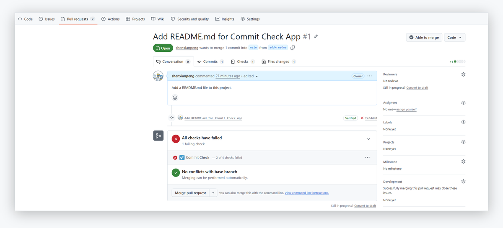
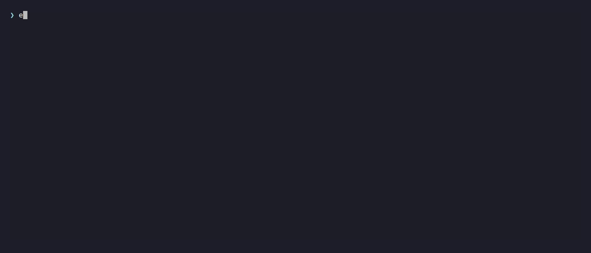
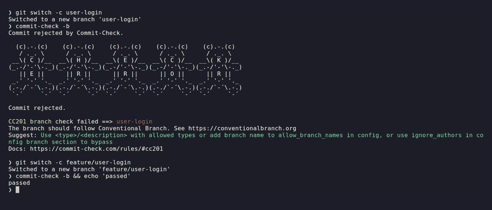

---
hide:
  - navigation
  - toc
template: landing.html
title: Commit Check
description: One config file enforced in your commit-msg hook, in CI, on every pull request and in your AI agent. Rules for commit messages, branch names, author identity and signoff.
---

<!-- markdownlint-disable MD041 MD033 MD036 MD025 -->

<div class="cc-hero" markdown>
<div class="cc-hero__copy" markdown>

# One config file. Every place your team commits.

Laptop, CI, pull request, AI agent — the same `cchk.toml`, the same rules,
the same diagnostics, with a fix you can paste.

[Get started :octicons-arrow-right-24:](getting-started.md){ .md-button .md-button--primary }
[Browse the rules](rules.md){ .md-button }

</div>
<div class="cc-hero__demo" markdown>

```console
$ echo 'Fix: add streaming support' | commit-check --message
CC001 message check failed ==> Fix: add streaming support
The commit message should follow Conventional Commits. See https://www.conventionalcommits.org
Suggest: Use "fix: add streaming support"
Docs: https://commit-check.com/rules/#cc001
```

When the correction is unambiguous, it hands you the line.

</div>
</div>

<div class="cc-proof" markdown>

**Commit Check runs in repositories across these organizations, and in
[many more](https://github.com/commit-check/commit-check-action/network/dependents).**

<div class="logo-grid">
  <div class="logo-item">
    
    <span>Apache</span>
  </div>
  <div class="logo-item">
    
    <span>Discovery Unicamp</span>
  </div>
  <div class="logo-item">
    
    <span>Texas Instruments</span>
  </div>
  <div class="logo-item">
    
    <span>OpenCADC</span>
  </div>
  <div class="logo-item">
    
    <span>Extrawest</span>
  </div>
  <div class="logo-item">
    
    <span>Chainlift</span>
  </div>
  <div class="logo-item">
    
    <span>Mila</span>
  </div>
  <div class="logo-item">
    
    <span>RLinf</span>
  </div>
  <div class="logo-item">
    
    <span>Istio Ecosystem</span>
  </div>
  <div class="logo-item">
    
    <span>Juniper Networks</span>
  </div>
  <div class="logo-item">
    
    <span>French National Parks</span>
  </div>
  <div class="logo-item">
    
    <span>OpenDriveLab</span>
  </div>
  <div class="logo-item">
    
    <span>UT Austin RobIn</span>
  </div>
  <div class="logo-item">
    
    <span>WorldArena2</span>
  </div>
  <div class="logo-item">
    
    <span>moniqo</span>
  </div>
  <div class="logo-item">
    
    <span>elu mobility</span>
  </div>
  <div class="logo-item">
    
    <span>Open Energy Platform</span>
  </div>
  <div class="logo-item">
    
    <span>Collective</span>
  </div>
</div>

</div>

## Why check commit metadata at all

<div class="cc-cards" markdown>

-   __Changelog tools have nothing to group by__

    ---

    `git-cliff` and `semantic-release` read the `type:` prefix on the subject
    line to decide what a commit was. Without a consistent subject there is
    nothing to read, and the release notes get written by hand from `git log`.

-   __`git bisect` stops at a merge commit__

    ---

    When the first bad commit is a merge, the change is in one of two parents
    or in the conflict resolution. Bisect cannot narrow it any further.

-   __The author is `ec2-user`__

    ---

    A build box with no `user.name` set writes itself into the history.
    `git log --author` finds the commit; there is no person on the other end
    of it.

-   __A DCO check fails on a branch you already wrote__

    ---

    `Signed-off-by` costs one `-s` at commit time. Adding it afterwards means
    `git rebase --signoff` across the whole branch and a force-push.

</div>

None of these are caught by a linter, a type checker or a test suite. They are
caught in review — which means inconsistently, and after the work is done.

The check that runs in CI is the same one that runs in your `commit-msg` hook.
Fixing a subject line at commit time costs a second; fixing it after CI costs a
full run and a force-push.

## What your team actually sees

On a pull request, every finding carries a rule ID, the value that failed, and
what to do about it — in the job summary, as annotations on the changed files,
and as a single comment that is edited in place rather than added to.

| Scope | Checked value | Failed checks |
|---|---|---|
| Commit 2/2 (5584f46) | `bad msg` | CC001 message |
| Branch | `Feature/Add-Login` | CC201 branch |

```text
Commit message
  ✔ PR title (feat: add login page)
  ✔ Commit 1/2 (d87faca) (feat: add login page)
  ✖ Commit 2/2 (5584f46) (1 failure)
      CC001 message
        value: bad msg
        The commit message should follow Conventional Commits.
        Suggest: Use <type>(<scope>): <description>
Branch
  ✖ Branch (1 failure)
      CC201 branch
        value: Feature/Add-Login
        The branch should follow Conventional Branch.
        Suggest: Rename the branch to "feature/Add-Login" (git branch -m feature/Add-Login)
        Fix: feature/Add-Login
```

And in the merge box, where the decision actually gets made:

<figure class="cc-shot" markdown>
{ loading=lazy }
<figcaption>The hosted GitHub App reports one check run per commit. The title
names what failed, so nobody opens Details to learn whether it was the message,
the branch or an author email.</figcaption>
</figure>

<figure class="cc-shot" markdown>
{ .cc-motion loading=lazy }
{ .cc-still loading=lazy }
<figcaption>The same engine on the command line. The recording is replaced by a
still frame when your system asks for reduced motion.</figcaption>
</figure>

## Start with two commands

```console
$ pip install commit-check
$ commit-check --message --branch
```

No configuration file needed to start: the defaults check Conventional Commits,
Conventional Branch and subject length, and you tighten them when you are ready. Every release
carries a signed [build provenance attestation](https://docs.github.com/en/actions/concepts/security/artifact-attestations),
so you can verify an artifact came from this repository's pipeline before you
install it.

## Pick where it runs

One policy engine, five places to enforce it. Every one of them reads the same
`cchk.toml`.

<div class="cc-cards" markdown>

-   __Command line__

    ---

    The engine itself. Any forge, any CI, plus a JSON mode and a Python API for
    scripts and agents.

    [:octicons-arrow-right-24: Getting started](getting-started.md)

-   __pre-commit hook__

    ---

    It rejects a bad commit before Git records it.
    Opt-in by nature, so pair it with one of the enforced surfaces.

    [:octicons-arrow-right-24: Guide](guides/pre-commit.md)

-   __GitHub Action__

    ---

    Runs in CI whether or not the hook ran. Make it a required check and a
    violation cannot merge, with per-rule outputs later steps can gate on.

    [:octicons-arrow-right-24: Guide](guides/github-actions.md)

-   __GitHub App__

    ---

    No workflow file and no CI minutes. Install it once and every push and pull
    request gets a check run.

    [:octicons-arrow-right-24: Guide](guides/github-app.md)

-   __MCP server__

    ---

    The validations as structured tools, so an AI coding agent checks its own
    commit before it writes it.

    [:octicons-arrow-right-24: Guide](guides/mcp.md)

</div>

## Pricing

The CLI, the pre-commit hook, the GitHub Action and the MCP server are MIT
licensed — no account, no limits, nothing to buy. The plans below are for the
hosted GitHub App, the one surface we run for you.

<div class="cc-pricing" markdown>

-   __Open Source__ · Free

    ---

    Public repositories, on any account.

-   __Personal__ · Free

    ---

    Private repositories on a personal account.

-   __Team__ · $19 / month

    ---

    Private repositories in an organization, however many of you there are.
    14-day free trial.

</div>

[:octicons-arrow-right-24: Install the App](https://github.com/apps/commit-check)

Nothing is blocked while you try it. Without a config file the App reports its
findings but leaves the check run neutral, and it never rejects a push — the
only way Commit Check blocks a merge is if you make it a required check
yourself.

GitHub can enforce some of the same policies natively, but the commit-metadata
rules sit behind its Enterprise plan. For a twenty-person team that is the
difference between $4 and $21 a seat — about $340 a month for a regular
expression, which reports a bare mismatch where Commit Check reports a rule ID,
a suggestion and a link. The Team plan here is $19 a month whatever the team
size.
[The arithmetic, and the caveats](compare/github-rules.md).

## Questions

??? question "Does it read my source code?"

    No. The CLI validates commit metadata and never opens your files. The
    hosted App uses a blob-filtered fetch and a sparse checkout that
    materializes only the config files, so no other repository content is ever
    downloaded. Content scanning is deliberately out of scope.

??? question "Can a developer bypass it?"

    The pre-commit hook, yes: `git commit --no-verify` is one flag, and a local
    hook is there for fast feedback. The enforcement boundary is CI. Make the Action or the App a required status check and a
    violating change cannot merge, however it was committed.

??? question "Will turning it on block everyone tomorrow?"

    No. Without a config file the App reports in full but leaves the check
    neutral, and it never rejects a push. Most rules are off until you turn
    them on — the [rules reference](rules.md#rule-index) marks which start on.

??? question "What about the history I already have?"

    Only new commits are checked. Nothing asks you to rewrite what is already
    merged.

??? question "Does it only work on GitHub?"

    The CLI and the pre-commit hook run anywhere Git does — GitLab, Gitea,
    Bitbucket, a local machine. The Action and the App are GitHub-specific
    because they integrate with GitHub's check runs.

??? question "Do I need Node.js?"

    No. On a modern Python there are no runtime dependencies at all.

??? question "Which Python versions are supported?"

    3.10 through 3.14. CI runs the suite on all five, across Linux, macOS and
    Windows — fifteen combinations on every change.

??? question "How do I know the package I installed is the one you built?"

    Every release carries a signed
    [build provenance attestation](https://docs.github.com/en/actions/concepts/security/artifact-attestations)
    naming the workflow in this repository that built it. Check a wheel
    yourself with `gh attestation verify <file> --repo commit-check/commit-check`;
    the GitHub Action runs the same check before it installs anything, and
    fails the step if verification does not pass.

??? question "Who is behind this?"

    Commit Check is written and maintained by
    [Xianpeng Shen](https://github.com/shenxianpeng), who also runs the hosted
    App. The engine, the Action, the App and the MCP server are open source
    under the [commit-check](https://github.com/commit-check) organization —
    if the hosted App ever stops, the [GitHub Action](guides/github-actions.md)
    reads the same config and reports the same rule IDs.

<div class="cc-community" markdown>

## Questions, bugs, contributions

**Start a [discussion](https://github.com/commit-check/commit-check/discussions)**
if you are weighing up a policy, are not sure whether something is a bug, or
want to know how other projects have handled it.

**Open an [issue](https://github.com/commit-check/commit-check/issues)** when
something is broken or missing — include the output of
`commit-check --format json`, which carries the rule ID and the value that
failed.

**Send a pull request** to any of the
[repositories](https://github.com/commit-check). The engine, the Action, the App
and the MCP server are separate projects.

[Discussions :fontawesome-brands-github:](https://github.com/commit-check/commit-check/discussions){ .md-button .md-button--primary }
[Issues :fontawesome-brands-github:](https://github.com/commit-check/commit-check/issues){ .md-button }

</div>
