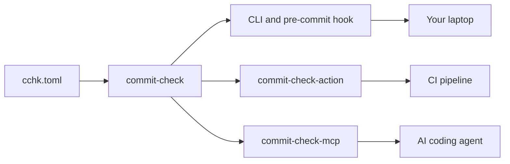

---
hide:
  - navigation
  - toc
template: home.html
title: Commit Check
description: Enforce commit message, branch naming, author and signoff standards across your CLI, pre-commit hooks, CI, and AI agents.
---

<!-- markdownlint-disable MD041 MD033 MD036 MD025 -->

<!-- The visible page title is the hero's, rendered full-width by
     overrides/home.html. This heading is hidden, and exists only because
     Material injects a title of its own — the nav label, "Home" — into any
     page whose content has none, which would compete with the hero. -->

# Commit Check { .cc-page-title }

## One config, enforced everywhere

Write the policy once. The same rules run on a developer's laptop, in CI, and in
whatever your AI agent is committing on your behalf.

=== "Command line"

    ```console
    $ commit-check --message --branch
    CC003 subject-imperative check failed ==> docs: revamped the profile
    Commit message should use imperative mood (e.g., 'fix bug' not 'fixed bug')
    Suggest: Change the first verb to imperative form
    Docs: https://commit-check.com/rules/#cc003
    ```

=== "pre-commit"

    ```yaml title=".pre-commit-config.yaml"
    repos:
      - repo: https://github.com/commit-check/commit-check
        rev: v2.13.4
        hooks:
          - id: check-message
          - id: check-branch
    ```

=== "GitHub Actions"

    ```yaml title=".github/workflows/commit-check.yml"
    - uses: commit-check/commit-check-action@v2
      env:
        GITHUB_TOKEN: ${{ secrets.GITHUB_TOKEN }}
      with:
        message: true
        branch: true
        pr-comments: ${{ github.event_name == 'pull_request' }}
    ```

=== "AI agents"

    ```json title="MCP server"
    {
      "mcpServers": {
        "commit-check": {
          "command": "uvx",
          "args": ["commit-check-mcp"]
        }
      }
    }
    ```

## Start with two commands

```console
$ pip install commit-check
$ commit-check --message --branch
```

No configuration file needed to start — sensible defaults apply immediately, and
you tighten them when you are ready. Releases carry
[SLSA Level 3](https://slsa.dev) build provenance, so you can verify an artifact
came from this repository's pipeline before you install it.

[Get started :octicons-arrow-right-24:](getting-started.md){ .md-button .md-button--primary }
[Rules reference](rules.md){ .md-button }

## Why it exists

Git history is a database that every team writes to and almost nobody validates.

The cost shows up later, and indirectly. Release notes get written by hand
because commit subjects cannot be grouped. A `git bisect` ends on a merge
commit, where the change that broke the build could be in either parent or in
the resolution. A commit is attributed to `ec2-user` because a build box had no
`user.name`. A branch has its history rewritten months later because none of its
commits carried a `Signed-off-by` trailer.

None of these are caught by a linter, a type checker, or a test suite. They are
all caught by review — which means inconsistently, by whoever happens to be
looking, and only after the work is done.

Commit Check makes them mechanical instead, and catches them where it is
cheapest: the check that runs in CI is the same one that runs in your
`commit-msg` hook, where a malformed subject costs a second to fix rather than a
full CI cycle and a force-push.

It treats commit metadata the way linters treat code — a policy written down
once, enforced identically everywhere, with a stable identifier for every
diagnostic so findings can be discussed, cited, and tracked.

Not all of that policy is on to begin with. Two of the four problems above are
decisions rather than defects — whether merge commits belong in your history,
and whether contributors must sign off — and they stay off until you make them.
The [rules reference](rules.md#rule-index) marks which rules start on.

## What it checks

<div class="grid cards" markdown>

-   :material-message-text-outline:{ .lg .middle } __Commit messages__

    ---

    Conventional Commits by default, or your own pattern. Subject length, mood,
    capitalisation, required body, forbidden merge/fixup/WIP commits.

    [:octicons-arrow-right-24: CC001–CC013](rules.md#commit-message-rules)

-   :material-source-branch:{ .lg .middle } __Branch names__

    ---

    Conventional Branch naming, plus rebase checks that catch a branch drifting
    behind its target before CI wastes a run on stale code.

    [:octicons-arrow-right-24: CC201–CC202](rules.md#branch-rules)

-   :material-account-check-outline:{ .lg .middle } __Committer identity__

    ---

    Catch commits authored by `ec2-user` on a build box, or require everyone to
    contribute from a company address.

    [:octicons-arrow-right-24: CC101–CC102](rules.md#author-rules)

-   :material-file-sign:{ .lg .middle } __Signoff and DCO__

    ---

    Require the `Signed-off-by` trailer locally, so contributors find out before
    CI rejects the pull request.

    [:octicons-arrow-right-24: Policy guides](guides/policies.md#require-signoff-dco)

-   :material-robot-outline:{ .lg .middle } __AI attribution__

    ---

    Whatever your project has decided about AI-assisted commits, enforce it
    mechanically instead of relitigating it in review.

    [:octicons-arrow-right-24: Policy guides](guides/policies.md#ai-attribution)

-   :material-office-building-outline:{ .lg .middle } __Org-wide policy__

    ---

    Inherit a base config from a shared repository, then let each project
    override only what it needs.

    [:octicons-arrow-right-24: Integrations](guides/integrations.md#across-an-organization)

</div>

## What it is not

Commit Check is deliberately narrow: it validates *metadata*, not code.

- **Not a code linter.** It never reads your source files.
- **Not a replacement for review.** It enforces the mechanical rules so review
  can spend its attention on the change itself.
- **Not opinionated by default.** Most rules are off until you turn them on. See
  the [rules reference](rules.md) for what applies out of the box.

It is a lightweight, open alternative to
[GitHub Enterprise metadata restrictions](https://docs.github.com/en/enterprise-server@3.11/repositories/configuring-branches-and-merges-in-your-repository/managing-rulesets/available-rules-for-rulesets#metadata-restrictions)
and Bitbucket's paid
[Yet Another Commit Checker](https://marketplace.atlassian.com/apps/1211854/yet-another-commit-checker),
without requiring a particular forge or an enterprise plan. If you already run
`ruff`, `eslint` or `golangci-lint` on your source, Commit Check is the
equivalent for the commits that carry it.

## Ecosystem

One policy engine, multiple enforcement surfaces. Write your `cchk.toml` once —
every surface reads the same file.



<div class="grid cards" markdown>

-   :fontawesome-brands-python: __commit-check__

    ---

    **Core engine** — Python CLI, library and pre-commit hooks. Runs every
    validation the other surfaces expose.

    [:octicons-arrow-right-24: Getting started](getting-started.md)
    [:octicons-arrow-right-24: Repo](https://github.com/commit-check/commit-check)

-   :material-github: __commit-check-action__

    ---

    **GitHub Action** — CI integration that posts results as check runs, job
    summaries and pull request comments.

    [:octicons-arrow-right-24: Guide](guides/integrations.md#in-github-actions)
    [:octicons-arrow-right-24: Repo](https://github.com/commit-check/commit-check-action)

-   :material-robot: __commit-check-mcp__

    ---

    **MCP server** — exposes the validations as structured tools for AI coding
    agents such as Claude Code, Cursor and Copilot.

    [:octicons-arrow-right-24: Repo](https://github.com/commit-check/commit-check-mcp)

</div>

## Used by

<div class="trusted-by" markdown>

**Commit Check runs in repositories across these organizations, and in
[many more](https://github.com/commit-check/commit-check-action/network/dependents).**

<div class="logo-grid">
  <div class="logo-item">
    
    <span>Apache</span>
  </div>
  <div class="logo-item">
    
    <span>Discovery Unicamp</span>
  </div>
  <div class="logo-item">
    
    <span>Texas Instruments</span>
  </div>
  <div class="logo-item">
    
    <span>OpenCADC</span>
  </div>
  <div class="logo-item">
    
    <span>Extrawest</span>
  </div>
  <div class="logo-item">
    
    <span>Chainlift</span>
  </div>
  <div class="logo-item">
    
    <span>Mila</span>
  </div>
  <div class="logo-item">
    
    <span>RLinf</span>
  </div>
  <div class="logo-item">
    
    <span>Istio Ecosystem</span>
  </div>
  <div class="logo-item">
    
    <span>Juniper Networks</span>
  </div>
  <div class="logo-item">
    
    <span>French National Parks</span>
  </div>
  <div class="logo-item">
    
    <span>OpenDriveLab</span>
  </div>
  <div class="logo-item">
    
    <span>UT Austin RobIn</span>
  </div>
  <div class="logo-item">
    
    <span>WorldArena2</span>
  </div>
  <div class="logo-item">
    
    <span>moniqo</span>
  </div>
  <div class="logo-item">
    
    <span>elu mobility</span>
  </div>
  <div class="logo-item">
    
    <span>Open Energy Platform</span>
  </div>
  <div class="logo-item">
    
    <span>Collective</span>
  </div>
</div>

</div>

---

<div class="community-section" markdown>

## Questions, bugs, contributions

**Start a [discussion](https://github.com/commit-check/commit-check/discussions)**
if you are weighing up a policy, are not sure whether something is a bug, or
want to know how other projects have handled it.

**Open an [issue](https://github.com/commit-check/commit-check/issues)** when
something is broken or missing — include the output of
`commit-check --format json`, which carries the rule ID and the value that
failed.

**Send a pull request** to any of the
[repositories](https://github.com/commit-check). The engine, the Action and the
MCP server are separate — [Ecosystem](#ecosystem) above shows which is which.

[Discussions :fontawesome-brands-github:](https://github.com/commit-check/commit-check/discussions){ .md-button .md-button--primary }
[Issues :fontawesome-brands-github:](https://github.com/commit-check/commit-check/issues){ .md-button }

</div>
